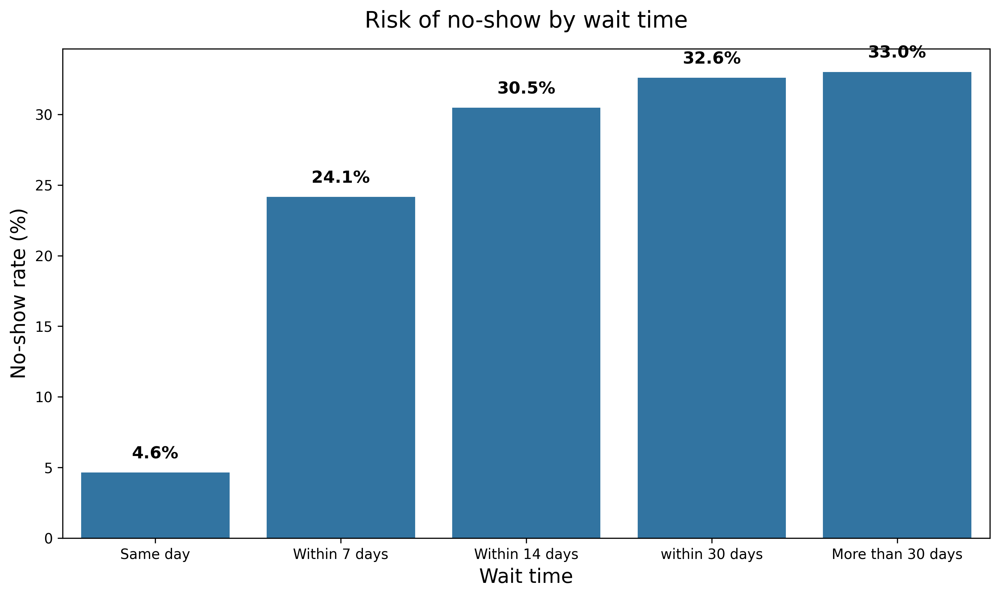
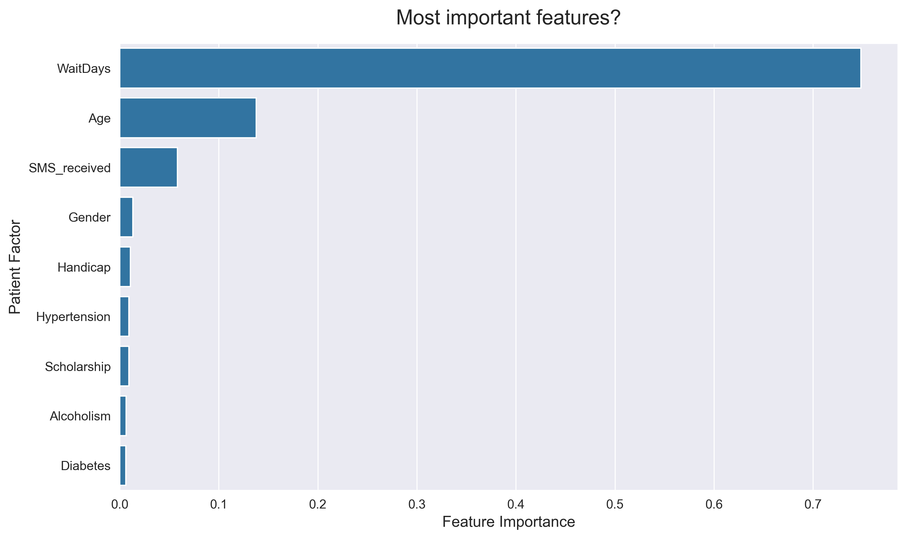

# Prediction of Patient No-Shows

# Project Scope
Project addresses a classic and expensive problem in health care: Patients absent from appointments (No-Shows). When patients miss apoointments without prior notice, it lead to underutilized medical staff and increased costs for the hospital.

The goal of this ML pipeline is to predict which patients are more likely to miss their appointments. Identifying these pations in advance opens the door for proactive interventions, such as SMS reminders or follow-ups.

## Data Source
The dataset used in this project is the **Medical Appointment No Shows** dataset sourced from [Kaggle](https://www.kaggle.com/datasets/joniarroba/noshowappointments). It contains 110.527 medical appointments from Brazil.

## Key Insights (EDA)
Through exploratory data analysis, logistical factors stood out in predicting attendance:
1. **Lead time:** Patients with "same-day" appointments are almost guaranteed to show up. However, once the waiting period exceeds 14 days, the risk of pations no-show significantly increases.
2. **Age:** Age is another major predictor of attendance, most likely reflecting differences in lifestyle and levels of dependency across different age groups.



## ML Model
Implemented a **Random Forest Classifier** to predict the likelihood of a patient no-show.

It was deemed more important to prioritize **Recall** than **Precision**, since sending a false alarm is less costly (sending a SMS-reminder to someone who was going to show up), than a "missed alarm" (not predicting a no-show).
Therefore, the model is tuned with `class_weight='balanced'`.

### Performance on Unseen Test Data:
**Recall for No-Shows:** **80%**
**Business Value:** The model identifies 8 out of 10 patients who will fail to show up, allowing for intervention.



## Project Structure
The repository is structured as a production-ready pipeline, with experimental research (notebooks) separated from core logic (src).
```
├NoShow-insight/
│
├── data/                  # Raw and processed datasets (Git ignored)
├── models/                # Model file (joblib)
├── notebooks/             # Jupyter notebooks for EDA and experimentation
├── src/                   # Python source code
│   ├── __init__.py        # Indicates that src is a Python package
│   ├── data_prep.py       # Data cleaning and feature engineering pipeline
│   └── train.py           # Model training and evaluation script
│
├── .gitignore             
├── requirements.txt      
```

## Getting Started

**1. Clone the repository and install dependencies:**
```bash 
git clone [https://github.com/mathiaswela/NoShow-insight.git](https://github.com/mathiaswela/NoShow-insight.git)
cd NoShow-insight
pip install -r requirements.txt
```
**2. Download the data**
1. Download the dataset from [Kaggle here](https://www.kaggle.com/datasets/joniarroba/noshowappointments)
2. Create a folder named `data/` in project root.
3. Place the CSB file in the folder and rename it to `noshow_data.csv`.

**3. Run pipelines**
```bash
python src/data_prep.py
python src/train.py
```


